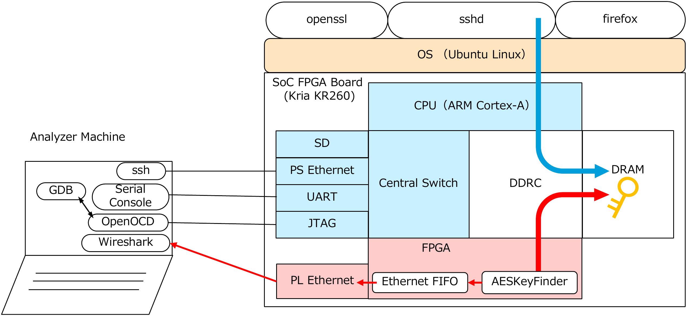

# Periodic-AESKeyFinder

This repository contains the source code of Periodic-AESKeyFinder along with auxiliary scripts for analysis.
The FPGA source code can be found under the fpga directory.
The scripts used for investigating key zeroization are located under the scripts directory.




# Project Structure

```plaintext
Periodic-AESKeyFinder/
├── README.md
├── claim
│   └── claim1
├── evaluation
│   ├── TLS
├── fpga    # FPGA files
│   ├── AXKU062     # Project file for AXKU062 FPGA board
│   ├── AXKU3       # Project file for AXKU3 FPGA board
│   ├── KR260       # Project file for KR260 FPGA board
│   ├── KeyFinder   # Periodic-AESKeyFinder source code
│   └── README.md
├── install.sh      # 
└── scripts 
    ├── aeskeyfinder.lua    # Wireshark Lua script to interpret Periodic-AESKeyFinder output
    ├── linux
    └── windows
```


## fpga directory
<!--
論文のセクション4.3 「Design」に対応するFPGAの設計を格納しています。
-->
This directory contains the FPGA design corresponding to Section 4.3 “Design” of the paper.

## scripts directory
<!--
論文のセクション4.2 「Key Persistence Inspection Method Using Periodic-AESKeyFinder」で説明した手順を実行するときに使用したスクリプトを格納しています。
-->
This directory contains the scripts used to execute the procedure described in Section 4.2 “Key Persistence Inspection Method Using Periodic-AESKeyFinder” of the paper.

## evaluation directory
<!--
論文のセクション4.5 「Evaluation of Periodic-AESKeyFinder」で行ったPeriodic-AESKeyFinderの評価実験に用いたスクリプトを格納しています。
-->
This directory contains the scripts used for the evaluation experiments of Periodic-AESKeyFinder, as described in Section 4.5 “Evaluation of Periodic-AESKeyFinder” of the paper.

---


# Project Requirements

## Hardware
<!--
このプロジェクトは論文の表1で示したTarget Platformで動作を確認しています。
下記のFPGAボード（3つ全て揃える必要はありません）が必要です。
-->
This project has been verified on the target platforms listed in Table 1 of the paper.  
The following FPGA boards are required (it is not necessary to have all three):

**FPGA board**: 
- Xilinx KR260 
- Alinx AXKU062 
- Alinx AXKU3

## Software
**Ubuntu 22.04**

**Xilinx Vivado 2023.2.2**

Visit [Xilinx Vivado 2023.2.2 download page](https://www.xilinx.com/support/download/index.html/content/xilinx/en/downloadNav/vivado-design-tools/archive.html).
Follow the instructions for downloading and installing Vivado on your system.


## License
"A license for LogiCORE Tri-Mode Ethernet MAC is required. Please refer to [UG973](https://docs.amd.com/r/en-US/ug973-vivado-release-notes-install-license/Release-Notes), and access https://account.amd.com/forms/license/license-form.html
 and follow the instructions."

